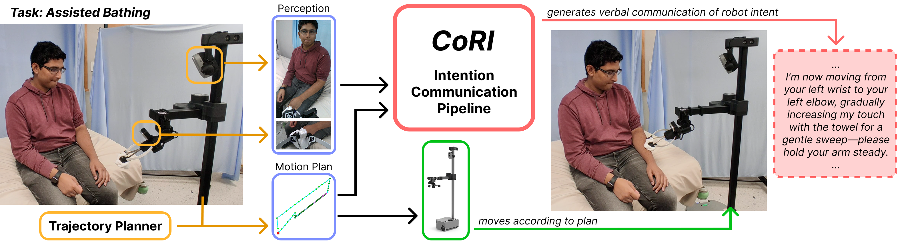

<div align="center">
  
  # CoRI: Communication of Robot Intent for Physical Human-Robot Interaction
  ### CoRL 2025
</div>

<div align="center">
  
</div>

<p align="left">
    <a href='https://arxiv.org/abs/2505.20537'>
      
    </a>
    <a href='https://cori-phri.github.io/'>
      
    </a>
</p>

This is the official repo for the paper:  

**[CoRI: Communication of Robot Intent for Physical Human-Robot Interaction](https://cori-phri.github.io/)**  
[Junxiang Wang](https://jimwang418.github.io/), [Emek Barış Küçüktabak](https://kucuktabak.com/), [Rana Soltani Zarrin](https://www.linkedin.com/in/rana-soltani), [Zackory Erickson](https://zackory.com/)
published at CoRL 2025

CoRI generates *natural-language* descriptions of an arbitrary robot trajectory's **intent**, **motion details**, and **desired user cooperation** in physical interactions, regardless of task or robot morphology.

## Table of Contents
- [Setup](#setup)
  - [Packages](#packages)
  - [Config files](#config-files)
  - [Other resources](#other-resources)
- [Running the code](#running-the-code)
- [Swapping out system components](#swapping-out-system-components)

## Setup
### Packages

What packages are needed largely depend on your hardware setup, but we list some common ones in requirements.txt, which should work on both setups we use: a Stretch 3 robot or an xArm7 with an external Zed Mini camera.

Some packages common in both setups are:
- `openai`, used to get VLM responses from ChatGPT
- `azure` from Microsoft Azure SDK, used for text-to-speech
- `pydub` and `simpleaudio`, used in text-to-speech for timing and playing audio segments
- `mediapipe`, used for pose recognition

### Config files

The code references certain config files (located under `configs`) to look for things like API keys. You should fill those fields before running the code. Some of these fields include serial numbers for RealSense cameras, OpenAI API key, Microsoft Azure API key and region, etc.

Besides these keys and serial numbers, if your setup has an xArm and an external camera, you will need to provide the `transform` field in the config file, specifying a 4x4 homogeneous transformation from the robot base frame to the camera coordinate frame. We provide a script for collecting images and performing the calibration in `scripts/vision/camera_calibration.py`, and you can test the calibration result with `scripts/vision/test_camera_calibration.py`. 

### Other resources

You should download the mediapipe recognition model `pose_landmarker_full.task` and put it under `resources` for proper code execution.

It is also worth noting that the URDF files in `resources` are specific to the particular Stretch robot used in development. It may be compatible with other Stretch robots to some degree, but it would be more accurate to modify them based on the URDF that comes with the robot that this code will be deployed on. 

## Running the code

You only need to run the file `main.py` and append different flags. The list of flags are as follows:
- `--bathing`, `--feeding`, `--shaving`: select the task to run. If multiple are provided, priority is given in this order.
- `--trial <x>`: select which trial to run, with either the option of 1 or 2.
- `--no_comm`: if you want to run the trial without communication, so the VLM pipeline would be skipped.
- `--baseline`: if you want to run the scripted baseline communication strategy.

For example, if we want to run bathing trial 2 with CoRI, the corresponding call should be:
```
python main.py --bathing --trial 2
```

## Swapping out system components

The code has been set up to be adaptable to different robot and camera combinations. Currently, the robots supported are Stretch SE3 and xArm 7, and the cameras supported are Realsense D435i and D405, as well as ZED Mini. If you are using these devices but have them setup differently, simply refer to the config files to see how you can specify the fields to work with your own setup.

Otherwise, if you have some other robot/camera, you can easily integrate it within pipeline by implementing a wrapper. See the `BaseCamera` class in `scripts/vision/cameras` and `BaseRobot` class in `scripts/robots` to see what functions you need to implement for a wrapper of your own camera/robot. Then you can write your own config file, and modify the `load_config.py` file to take into account your own system.

We also define base classes for the VLM client and text-to-speech in case those are of interest of being swapped to others as well.

## Citation
If you find this codebase/paper useful for your research, please consider citing:
```
@inproceedings{wang2025cori,
  title={Co{RI}: Communication of Robot Intent for Physical Human-Robot Interaction},
  author={Junxiang Wang and Emek Bar{\i}{\c{s}} K{\"u}{\c{c}}{\"u}ktabak and Rana Soltani Zarrin and Zackory Erickson},
  booktitle={9th Annual Conference on Robot Learning},
  year={2025}
}
```
